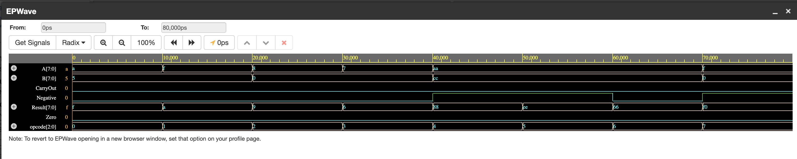

# 8-Bit ALU in Verilog

## Project Overview

This project implements an **8-bit Arithmetic Logic Unit (ALU)** in Verilog. It has a modular design, with separate modules for arithmetic, logic, shift operations, and control. It includes a **control unit** to emulate CPU-style operation selection.  

-The ALU supports:

 - Arithmetic operations: add, subtract, increment, decrement

 - Logical operations: AND, OR, XOR, NOT

 - Shift operations: logical and arithmetic shifts

 - Status flags: Zero, Carry, Overflow, Negative

A testbench runs all operations and generates waveform outputs for verification.

-Tools used:

 - EDA Playground – for writing and simulating Verilog code

 - Icarus Verilog – Verilog compiler and simulator

 - EPWave – waveform visualization

---

## Features

### Supported Operations
| Opcode | Operation | Description |
|--------|-----------|-------------|
| 000 | ADD | Adds A + B |
| 001 | SUB | Subtracts A - B |
| 010 | INC | Increment A by 1 |
| 011 | DEC | Decrement A by 1 |
| 100 | AND | Bitwise AND A & B |
| 101 | OR | Bitwise OR A \| B |
| 110 | XOR | Bitwise XOR A ^ B |
| 111 | NOT | Bitwise NOT ~A |

### Status Flags
- **Zero (Z):** Set if the result is zero  
- **CarryOut (C):** Set if arithmetic carry/borrow occurs  
- **Overflow (V):** Set if signed overflow occurs  
- **Negative (N):** Set if the result is negative (MSB=1)

---

## Design Details

The ALU is implemented in **three modular components**:

1. **alu_operations.v** – Implements arithmetic, logical, and shift operations  
2. **alu_control.v** – ALU Control Unit that maps opcode to ALU operation  
3. **alu.v** – Main ALU wrapper connecting operations and flags  

---

## Simulation

- The **testbench (alu_tb.v)** runs all operations and flags
- Generates **waveform file (`waveform.vcd`)** for GTKWave visualization
- Includes **pass/fail messages** in simulation console
- Supports **EDA Playground** or **ModelSim/Icarus Verilog**

---

## Waveform & Results

- Waveforms can be opened in **EPWave** to verify:
  - Operations
  - Status flag behavior
  - Input/output relationship

- 

## Author

Sarthak Omar
Electronics Engineering,
HBTU Kanpur(2027)
